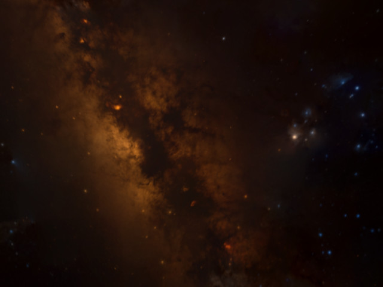
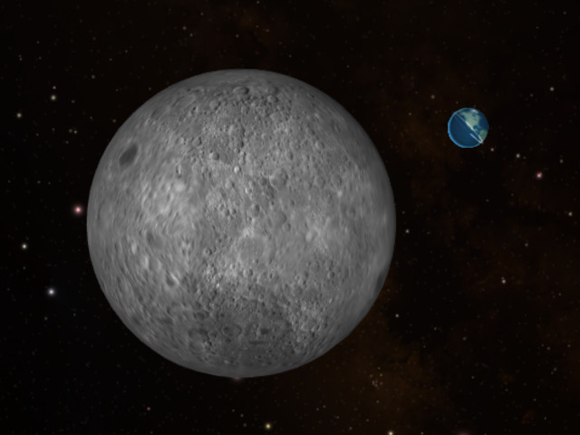
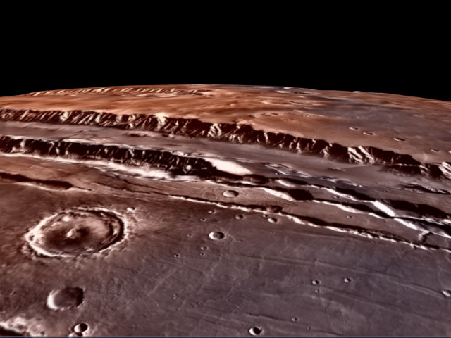
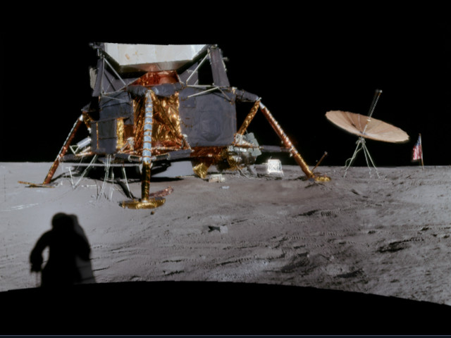

+++
date = 2020-04-18
title = "WWT for the Rest of Us"

[extra]
titlebox_class = "background-19038"
+++

AAS WorldWide Telescope isn’t only for professionals — it’s for anyone who’s
ready to be delighted by the beauty of our universe!

<section class="flex-cards">


In <b>explore mode</b>, navigate the sky like you would in your favorite maps
app — but choose which wavelength of light to vew, and pull up imagery taken
by the world’s best telescopes.



Watch guided <b>tours</b> that explain, educate, and entertain! Tours are
created by professional astronomers, educators, and people who just love the
night sky.


</section>

{{ bigbutton(text="Launch the Web client now", url="//worldwidetelescope.org/webclient/") }}

# Getting Started with WWT

{{ youtube(id="zooTDvbpdDQ", class="youtube-embed") }}

Learn more in our [Learn About WWT][youtube-learn] YouTube playlist.

[youtube-learn]: https://www.youtube.com/playlist?list=PLozhKWk-h8YABM7u4sDpj-TfEtW4Ciido

# Explore the Universe from Any Angle

<!-- hack since at max width flexbox with 4 items doesn't lay out how I'd like -->
<section class="flex-cards">



<b>Sky mode</b> lets you explore the sky as seen from Earth, overlaying images
from real telescopes.




<b>3D Universe mode</b> shows the Solar System in full 3D, and lets you zoom
out to see nearby stars, the Milky Way, and even other galaxies.


</section>
<section class="flex-cards">



<b>Earth</b> and <b>planet modes</b> let you examine the surfaces of planets
in detail — from the volcanoes of Mars to the Great Red Spot of Jupiter.




<b>Panorama mode</b> helps you plant your feet on another planet — showing
360° panorama photos from Moon landing sites, Mars rovers, and more.


</section>

{{ bigbutton(text="Start Exploring", url="//worldwidetelescope.org/webclient/") }}
